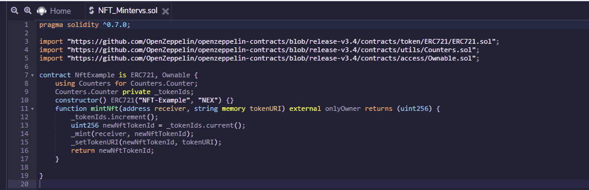
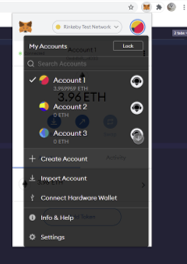
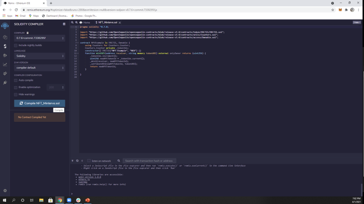
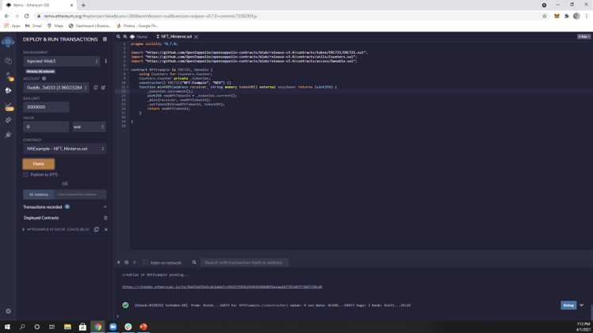
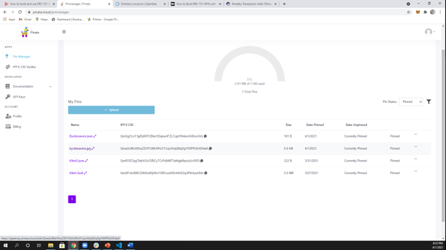
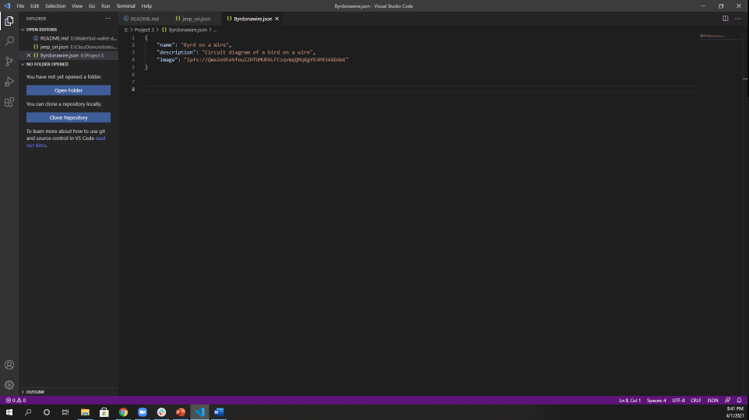
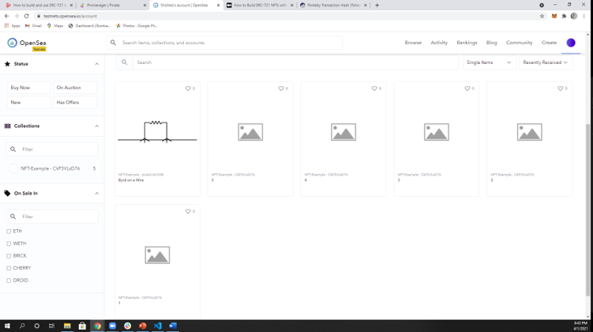

# How to Mint and List an NFT for Sale!

### Step One: Create the Solidity Contract
#### How to Creating the Solidity Contract
1. Determine Solidity version to use. This walkthrough uses 
```
pragma solidity ^0.7.0;
```
2. Import necessary depencies. This walkthrough uses<br>

```
import "https://github.com/OpenZeppelin/openzeppelin-contracts/blob/release-v3.4/contracts/token/ERC721/ERC721.sol";
import "https://github.com/OpenZeppelin/openzeppelin-contracts/blob/release-v3.4/contracts/utils/Counters.sol";
import "https://github.com/OpenZeppelin/openzeppelin-contracts/blob/release-v3.4/contracts/access/Ownable.sol";
```

3. Set contract to ERC721 for Non-Fungible Tokens.
4. Initialize counter for contract.
5. Assign counter to variable token ID's.
6. Create unique identifier based off hash value
7. Construct NFT using eRC721 protocol.
8. Create a function to mint the NFT's.
9. Ensure NFT based on the provided token URI has not previously been created 
10. Increments the counter to one to prevent a second NFT from being minted
11. Increment the counter.
12. Assign Token ID's.
13. Mint tokens.
14. Set token URI.
15. Return token ID.

#### Here is an image of a completed comtract


<hr>

### Step Two: Create MetaMask Account
#### How to Create MetaMask Account
1. Open [MetaMask](https://metamask.io/).
2. Download MetaMask.
3. Follow the installation wizard.
4. Create a MetaMask wallet.
5. Connect to the `Rinkeby Test Network`
6. Create an account
7. Follow directions at the [Rinkeby Faucet](https://faucet.rinkeby.io/) to fund your account.

#### Here is an image of a created MetaMask account


<hr>

### Step Three: Compile Contract
#### How to Compiling the Contract
1. Open [Remix](https://remix.ethereum.org/).
2. Paste in contract created in step one.
3. Select correct Solidity version on the compiler.
4. Press the `Compile` button.
5. Ensure compiling succeeds with no errors.

#### Here is an image of a contract compiling correctly.


<hr>

### Step Four: Deploy Contract
#### How to Deploying the Contract
1. Ensure MetaMask network is set to `Rinkeby Test Network`.
2. Select `Injected Web3` on the environment.
3. Step two should automatically connect you to MetaMask. Ensure you are on the right account for the transaction.
4. Press the `Deploy` button.
5. Ensure the transaction succeeds with no errors.

#### This is an image of a contract deploying correctly.


<hr>

### Step Five: Upload NFT Image to Pinata
#### How to Upload NFT Image to Pinata
1. Open [Pinata](https://pinata.cloud/).
2. Sign up/log in.
3. Press the `Upload` button.
4. Upload an image to represent your NFT.
5. Make note of your image hash. This will be needed in the next step.

#### This is an image of an image successfully uploaded to Pinata


<hr>

### Step Six: Create Token Metadata JSON File
#### How to Create Token Metadata JSON File
1. Create a JavaScript object with three key value pairs.
2. The first key is called `name`. The first value is your desired NFT token name.
3. The second key is called `description`. The second value is your desired NFT token description.
4. The third key is called `image`. The third value is your image hash from Pinata preceeded by `ipfs://`.
5. Upload the completed JSON file to Pinata.

#### This is an image of a JSON file created correctly.


<hr>

### Step Seven: Mint NFT
#### How to Mint NFT's
1. Expand the deployed contract in Remix.
2. Expand the `mintNFT` function in Remix.
3. Enter the wallet address of the reciever

<hr>

### Step Eight: Connect Wallet to OpenSea Test Nest
#### How to Connect Wallet to OpenSea Test Nest
1. Open [OpenSea](https://testnets.opensea.io/).
2. Create an account attatched to your MetaMask.
3. You will now be able to see your NFT inside OpenSea.

<hr>

#### This is an image of a successfully connected OpenSea network


### Step Nine: Set NFT for Sale
#### How to Set NFT for Sale
1. Hover over `NFT Image`. A tag will appear; click the tag to list item for sale.
2. Follow the instructions on OpenSea to set price and determine terms of sale.
3. Now you are done! All that is left to do is wait for a buyer. 😊

<hr>
<hr>
<hr>

# How to Purchase an NFT!

### Step One: Find Desired NFT
#### Suggestions on Finding an NFT
1. Open [OpenSea](https://testnets.opensea.io/).
2. Use the `Search` function to find an NFT of interest.

<hr>

### Step Two: Purchase Desired NFT
#### How to Purchase Desired NFT
1. Assuming your desired NFT is for sale, click `Buy It Now`.
2. Follow the instructions on OpenSea to complete the purchase.
3. Congratulations! 🎉 You are now a proud owner of an NFT!

<hr>
<hr>
<hr>

## Authors: Heather Byrd & Gregory Rash